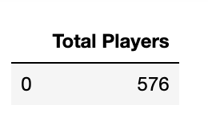
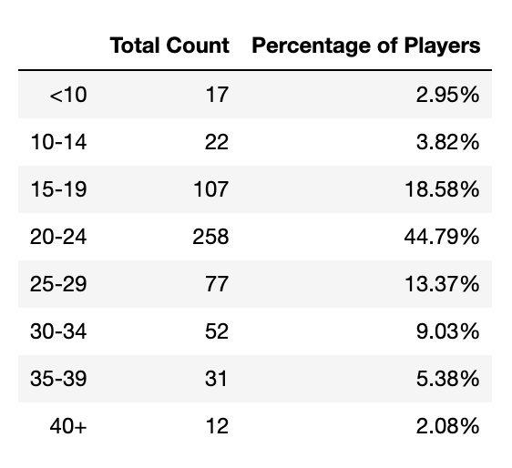

# Python Pandas Challenge
As Lead Analyst for an independent gaming company, I've been assigned the task of analyzing the data for their most recent fantasy game Heroes of Pymoli. 

Like many others in its genre, the game is free-to-play, but players are encouraged to purchase optional items that enhance their playing experience. I will generate a report that breaks down the game’s purchasing data into meaningful insights using Pandas.

## Files
Purchase data contains 
- Purcahse ID
- Screen name 
- Age
- Gender
- Item ID
- Item Name
- Price

## Report:
<b> Player Count </b>  

<b> Purchasing Analysis (Total) </b>  

<b> Gender Demographics </b>  

<b> Purchasing Analysis (Gender) </b>  

<b>Age Demographics </b>  

<b> Purchasing Analysis (Age) </b>  

<b> Top Spenders </b>  
Identify the the top 5 spenders in the game by total purchase value  

<b> Identify the 5 most popular items by purchase count </b>  

<b> Identify the 5 most profitable items by total purchase value </b>  

# Analysis
- 20-24 year olds have the highest total purchase value while 40+ year olds have the lowest total purchase value 
- Players who identified as male have the lowest average purchase price, yet they bring in the most total purchase value ($1,967.64)
- The most popular and profitable item was “Oathbreaker, Last Hope of the Breaking Storm.” It was purchased 12 times and the total purchase value was $50.76

