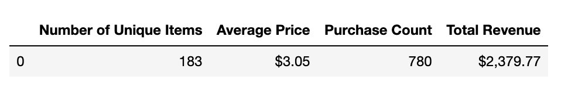

# Python Pandas Challenge
As Lead Analyst for an independent gaming company, I've been assigned the task of analyzing the data for their most recent fantasy game Heroes of Pymoli. 

Like many others in its genre, the game is free-to-play, but players are encouraged to purchase optional items that enhance their playing experience. I will generate a report that breaks down the game’s purchasing data into meaningful insights using Pandas.

## Files
Purchase data contains 
- Purcahse ID
- Screen name 
- Age
- Gender
- Item ID
- Item Name
- Price

## Report Includes:
<b> Player Count </b>  
- Total Number of Players

<b> Purchasing Analysis (Total) </b>  
- Number of Unique Items  
- Average Purchase Price  
- Total Number of Purchases  
- Total Revenue  

<b> Gender Demographics </b>  
- Percentage and Count of Male Players  
- Percentage and Count of Female Players  
- Percentage and Count of Other / Non-Disclosed  

<b> Purchasing Analysis (Gender) </b>  
The below each broken by gender:  
- Purchase Count  
- Average Purchase Price  
- Total Purchase Value  
- Average Purchase Total per Person by Gender  

<b>Age Demographics </b>  
The below each broken into bins of 4 years (i.e. <10, 10-14, 15-19, etc.):  
- Purchase Count  
- Average Purchase Price  
- Total Purchase Value  
- Average Purchase Total per Person by Age Group  

<b> Top Spenders </b>  
Identify the the top 5 spenders in the game by total purchase value, then list (in a table):  
- SN  
- Purchase Count  
- Average Purchase Price  
- Total Purchase Value  
- Most Popular Items  

<b> Identify the 5 most popular items by purchase count, then list (in a table): </b>  
- Item ID  
- Item Name  
- Purchase Count  
- Item Price  
- Total Purchase Value  
- Most Profitable Items  

<b> Identify the 5 most profitable items by total purchase value, then list (in a table): </b>  
- Item ID  
- Item Name  
- Purchase Count  
- Item Price  
- Total Purchase Value  

